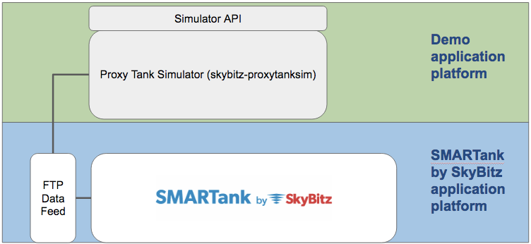

# skybitz-proxytanksim

Simple simulator program created to demonstrate the use of the Proxy Tanks data feed feature for SMARTank by SkyBitz.

This simulator is designed specifically for the example organization SMARTank Product Demo but can be used to help understand how to configure Proxy Tanks from a third-party system.

## Usage
This application simulates real usage data to be updated in SMARTank by the Proxy Tank Data Feed. It produces a csv file on a scheduled interval and copies to a designated FTP site to be processed by SMARTank.

The 'main' file for this program is broken into multiple parts per function. The core RunTankSim.py is responsible for updating and sending the simtanks.csv file to the data feed on a preset wake up scheulde. The FillTankSim.py file is a command line interface that updates data for simulating tank fill events. The api.py file is a simple web service implemented using the Flask microframework that is required for sending/receiving data via http requests.

Use of the Proxy Tank data feed for auto-updating inventory from third-party systems requires credentials; contact SkyBitz Sales or Support for access. 

For more details about SMARTank Proxy Tanks, please visit [http://www.skybitz.com/tank-monitoring](http://www.skybitz.com/tank-monitoring)

## Release History

* 2017.03 - v0.1
    * Initial working beta
* 2017.04 - v0.2
    * Restructured and added basic API support using flask - working but needs enhanced
    * TODO: Need to improve documentation

## Credits
Developed & maintained by Andrew Knight

## About
See requirements.txt for install dependencies.

Distributed under the Apache License V2.0. See ``LICENSE`` for more information.

[https://github.com/knightman/skybitz-proxytanksim](https://github.com/knightman/skybitz-proxytanksim)