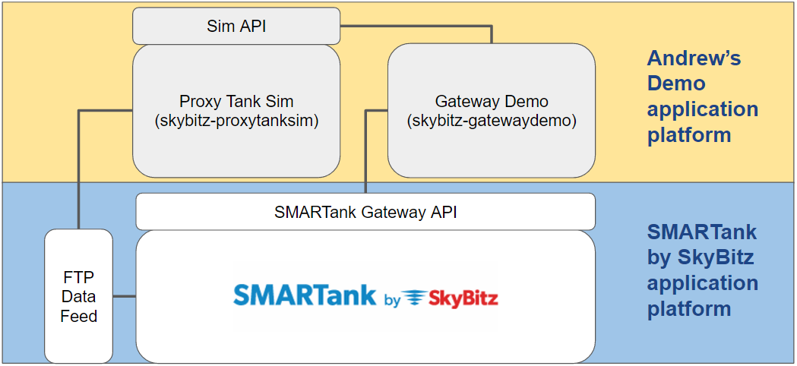

# skybitz-proxytanksim

Simple simulator program I created to demonstrate the use of the Proxy Tanks data feed feature for SMARTank.

For more details about SMARTank, please visit [http://www.skybitz.com/tank-monitoring](http://www.skybitz.com/tank-monitoring)

## Release History

* 2017.03 - v0.1
    * Initial working beta
* 2017.04 - v0.2
    * Restructured and added basic API support using flask - working but needs enhanced
    * TODO: Need to improve documentation

## Credits
Developed & maintained by Andrew Knight

## About

Distributed under the Apache License V2.0. See ``LICENSE`` for more information.

[https://github.com/knightman/skybitz-proxytanksim](https://github.com/knightman/skybitz-proxytanksim)